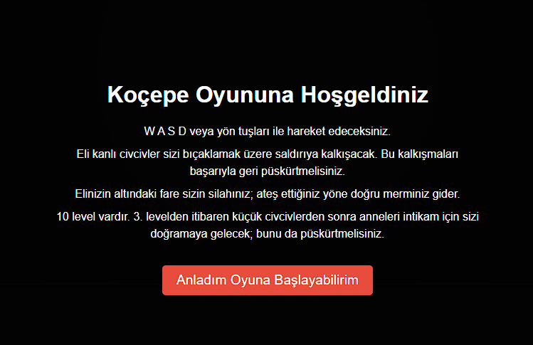
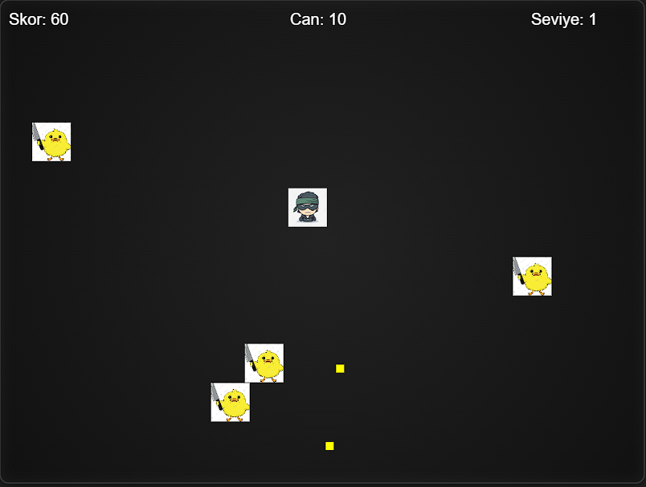
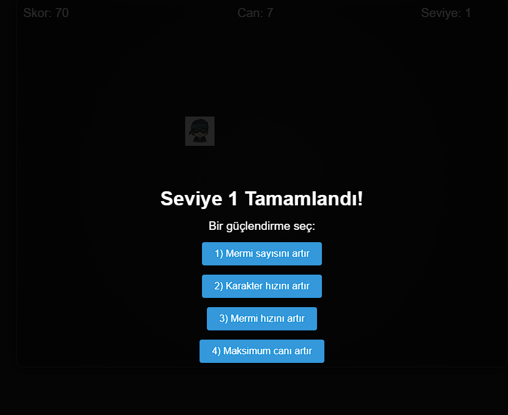

# JSgame
# Oyun Hakkında

1) HTML5 Canvas ile hazırlanmış basit bir 2D nişancı oyunu.

2) Fare tıklamasıyla nişan alıp mermi atılan, klavye ile hareket edilen bir oynanışa sahip.

# Özellikler

1) Hareket: W/A/S/D veya ok tuşlarıyla dört yönde gezinme.

2) Ateş Etme: Canvas’a tıklayarak oyuncudan tıklama noktasına doğru mermi fırlatma.

3) Seviye Sistemi: Her seviyede artan sayıda düşman; 3. seviyeden sonra seviyeye özel boss savaşı.

4) Yükseltmeler: Seviye geçişlerinde mermi sayısı, hız veya can artıran dört farklı güçlendirme seçeneği.

5) Geri Sayım: Her seviyenin başında 3 saniyelik ekran içi geri sayım.

6) Ses Efektleri: Atış ve arka plan müziği ile atmosfer; ses açma/kapatma düğmesi mevcut.

7) HUD: Ekranın üstünde “Skor”, “Seviye” ve “Can” değerleri sürekli gösteriliyor.

# Nasıl Oynanır

1) Başlatma ekranındaki “Başla” butonuna tıkla.

2) İlk olarak 3 saniyelik geri sayımı bekle.

3) WASD veya ok tuşlarıyla oyuncuyu hareket ettir.

4) Fare ile ekrana tıklayarak düşmanlara mermi gönder.

5) Tüm düşmanları temizleyince (3. seviyeden sonra boss’u da) yükseltme menüsü açılır.

6) Bir güçlendirme seç ve bir sonraki seviyeye devam et.

7) Oyuncu canı biterse “Oyun Bitti” uyarısı çıkar; yeniden başlatmak için R tuşuna bas.

<h1>Oyun'a Dair Fotoğraflar </h1> 

<h2>Oyunun Giriş Ekranı</h2>

<h2>Oyun İçi Fotoğrafı</h2>

<h2>Geliştirme Menüsüne Dair Fotoğraf</h2>

